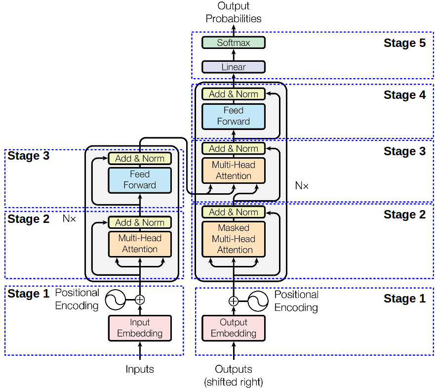

Check out the configuration reference at https://huggingface.co/docs/hub/spaces-config-reference

# GPT Text Generator

A simple text generation interface for a custom-trained GPT model.

## Project Overview

This project implements a GPT (Generative Pre-trained Transformer) model from scratch using PyTorch. The model is trained on text data and can generate human-like text based on given prompts.

### Model Architecture

  
  
<i>Transformer Architecture (Note: Our GPT implementation uses only the Decoder part, right side of the image) Source: Attention Is All You Need paper</i>

Our implementation includes:
- Transformer-based architecture with 12 layers (decoder-only)
- 12 attention heads
- 768-dimensional embeddings
- Context window of 128 tokens
- ~125M parameters
- Uses GPT-2 tokenizer (50,257 vocabulary size)

### Features
- Custom implementation of Multi-Head Attention
- Position embeddings
- Layer normalization
- Residual connections
- Dropout for regularization

### Training
- Trained using AdamW optimizer
- Learning rate: 3e-4
- Batch size: 1
- Maximum sequence length: 128 tokens
- Training continues until loss < 0.1 or max epochs reached
- Generates sample text every 10 epochs to monitor progress

### Interface
The model is served through a Gradio interface that allows users to:
- Input custom prompts
- Adjust generation parameters:
  - Maximum length of generated text
  - Temperature (controls randomness)
  - Top-k sampling parameter

  
  
<i>Text Generation Interface</i>

## Usage
Enter your prompt in the text box and adjust the generation parameters to control the output. Higher temperature values (>1.0) make the output more random, while lower values (<1.0) make it more focused and deterministic.

### Example Generations

- "I tell  because besides because tell because tell cob Lic tell because because tell why tell tell tell tell because tell tell because tell tell because tell tell tell Tro why because"
- "First Citizen:
Hello
Face titles::
jer gentleman:::ello:: Peter:::
P heed
stuff: upon:: Had furniture imp"

